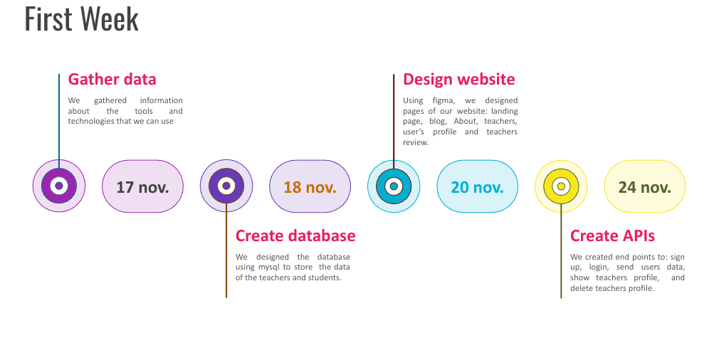
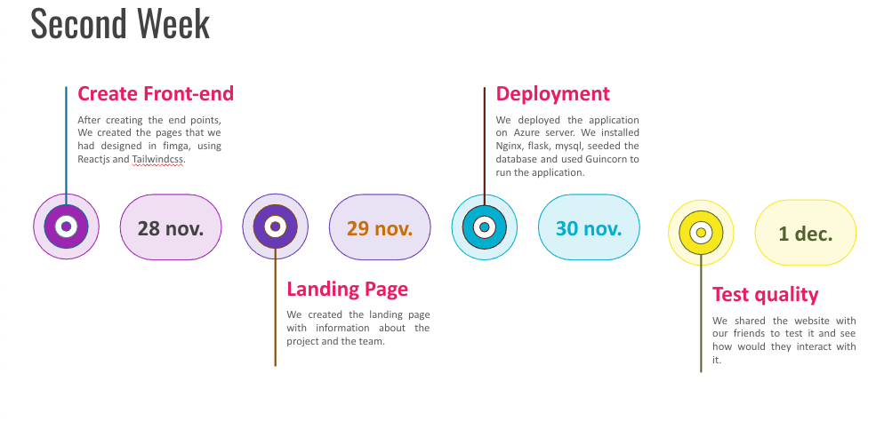
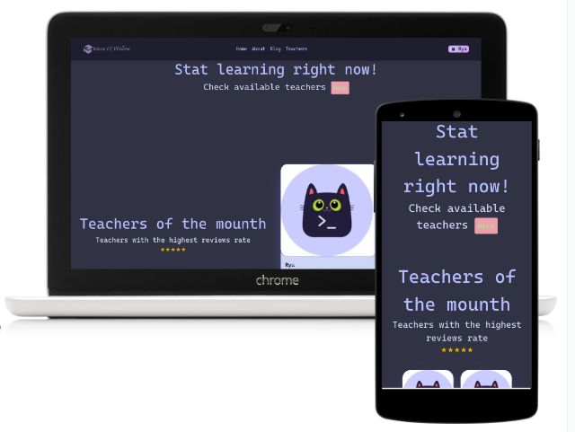
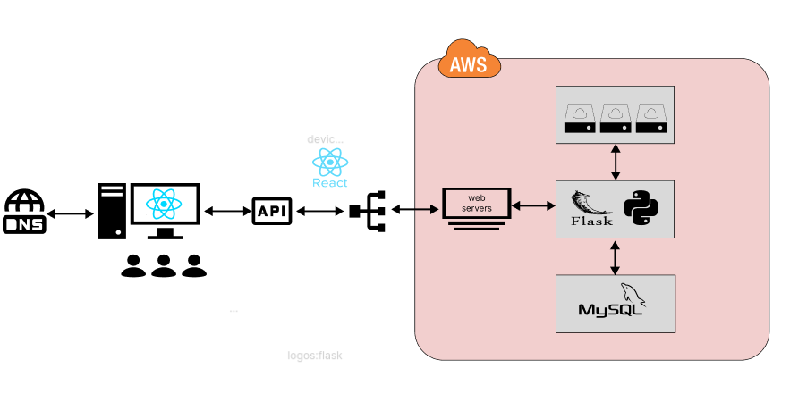

<div align="center">
  
# House of Wisdom Website 🏛️


At House Of Wisdom, we believe in the power of education to transform lives, and our Portfolio Project is dedicated to facilitating meaningful connections between Alx students seeking academic support and other Alx students eager to share their expertise.
<br/> <br/>
To take a look at our project, you can visit this website: [House of Wisdom](https://houseofwisdom.vercel.app/)
</div>
<br/>

## Team highlights 👥

Backend Developer<br/>
[AHRA Ahlane](https://github.com/kerzers): ALX SE Student<br/>
Cohort: 13

Frontend Developer<br/>
[EL HAMRANI Omar](https://github.com/RyuzakiiL23): ALX SE Student<br/>
Cohort: 13

As a team, we’ve been working and helping each others for a while now. And throughout our previous projects and our collaborative experiences, it has become evident that Ahlame possesses some skills in backend development, while Omar likes to handle frontend tasks.
What leads us to combine our strengths and collaborate closely, sharing knowledge and skills to ensure the success of our portfolio project! <br/> <br/>

#### Process & Collarboration ⚙️ 🤝

The process began with a comprehensive analysis of the current challenges faced by educators and students alike. 
Research was conducted to understand the needs of both parties and how technology could bridge existing gaps.
A user-centric design approach was employed to ensure the application is not just functional but also intuitive. 

Despite our limited experience, we leveraged our academic background and enthusiasm to collaborate effectively.

Our collaboration was characterized by frequent and open communication.
 
Daily check-ins and brainstorming sessions ensured that we stayed aligned with the project's goals.

#### Challengees overcome 🏆 

*Cloud Migration:* 

We encountered a significant hurdle when transitioning our server from AWS to Azure due to costly billing. This switch demanded resetting all server configurations from scratch, posing a substantial challenge.

*Database Stability*: 

Our database posed reliability issues, leading to our server crashing due to slow data fetching and potential synchronization issues in our Flask application with SQLAlchemy and React. Addressing this, we reconstructed our database using SQLAlchemy to ensure stability.


#### Timeline 🕒

<div align="center">
  

</div>

<br>

<div align="center">
  

</div>

## Project highlights 📁

**HouseOfWisdom** comes to solve the problem of students who looks for assistance during their journey or for getting help to complete or understand a specific task or topic.
We try to solve this by creating a platform that links students in a better way where everyone will have something to earn.

</br>
<div align="center">
  

</div>

#### 🏛️ Why House Of Wisdom ❓

Many of us has been in the situation where we need help but don't know who to ask for. Some of us don't want to disturb their peers, others fear the rejection, and some are only shy.
In our portfolio project we came up with solution for many of these problems and more ...

In our platform all students could create an account and share their knowledge with their peers. Every account is a student, and every account is a teacher...
Either looking for help, or having some extra time that you want to spend in a good purpose. We give all users the possibility to be a student and a teacher at the same time.

Set up a teacher profile and choose the programming language which you are good and could help other peers.


## Overview 🌟
1. **Technologies** 
2. **Installation** 
3. **Usage** 
4. **Contributors** 
5. **License** 

## Technologies ⚛️

<div align="center">


</div>

<br/>

***Backend***
- **Flask**: Web framework in Python.
- **MySQL**: Open-source relational database management system.

Libraries

1. **Flask-CORS** 
   - *Description*: Cross-origin resource sharing (CORS) for Flask.

2. **Flask-WTF** 
   - *Description*: Handles form submissions, validates data, and renders forms within Flask views.

3. **Flask-SQLAlchemy** 
   - *Description*: Flask extension simplifying the integration of SQLAlchemy, a SQL toolkit, and Object-Relational Mapping (ORM) library, with Flask applications.

4. **MySQL for Python** 
   - *Description*: MySQL driver for Python.

5. **UUID** 
   - *Description*: Generates UUIDs.

***Frontend***
1. **REACT**
  - *Description*: Javascript library.

2. **NextJS**
  - *Description*: React framework.

3. **Tailwind CSS**
  - *Description*: a organized way to use css.

***Web server***🌐
- **Nginx** 
- **Gunicorn** 

## Installation 🚀
***Getting Started***

- Clone this repo with --recurse-submodules flag:
```
git clone --recurse-submodules https://github.com/Kerzers/houseofwisdom.git
```
- Go to the repo:
```
cd houseofwisdom
```
- Make sure to install the required dependencies by running: `setup.sh`.
- Go to kns:
```
cd kns
```
- Setup the database by this command:
```
cat setup_dev.sql | sudo mysql
```
- Run the Flask application:
```
./run_app.py
```
- In a new terminal with the same path: Add a list of courses in the database by running this command:
```
cat add_courses | sudo mysql
```
- Now you should go to the front end folder and install React and Next js dependencies (Make sure that you have NodeJS installed on your machine):
```
cd ../frontend_test
npm install
```
-After installing dependencies you can start the front end with:
```
npm run dev
```
verify the port where frontend get lanched its port 3000 as default and you use that port on ur browser as a localhost.

## Usage 🚀
1. Access the backend API endpoints for the House of Wisdom website by using the routes if you want to test locally.

## Contributors 🤝
- [AHRA Ahlame](https://github.com/kerzers) - ahra.ahlame@gmail.com
- [Linkedin](https://www.linkedin.com/in/ahlame-ahra-8a5b4695/)

- [EL HAMRANI Omar](https://github.com/RyuzakiiL23) - elhamrani.omar23@gmail.com
- [Linkedin](https://www.linkedin.com/in/omar-el-hamrani/)

🎉 We are grateful to make it this far and bring our own House of wisdom website to life 😊!

## License 📜
This project is licensed under the MIT License Copyright (c) 2023 Omar EL HAMRANI Ahlame AHRA.
